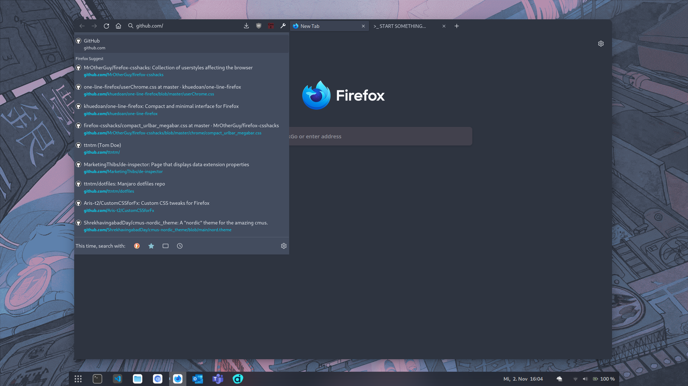

# minimal-one-line-firefox

Custom userChrome for Firefox to minimize the space used for url and tab bar:

_Working as of Nov. 6th 2022: Firefox 107.0b8 on Fedora 36 and 106.0 on Manjaro._

## Prerequisites & Setup

Go to `about:config` and set `toolkit.legacyUserProfileCustomizations.stylesheets` to `true`

`browser.compactmode.show` should also be set to `true` and enabled (see: [Ghacks article](https://www.ghacks.net/2021/04/07/mozilla-decides-to-hide-compact-mode-in-firefox-for-new-users-but-keep-it-for-existing-ones/))

After doing this, Firefox will try to load `userChrome.css` from the `chrome` folder inside your FF profile.

Use `about:support` to find the path to your profile folder. Example: `/home/USERNAME/.mozilla/firefox/abc1234.dev-edition-default/chrome/`

## Themes

Feel free to use a theme of your choice with these styles.

Tested with the default themes (light, dark, alpenglow) as well as a Nord theme (used in the screenshot above, [source](https://addons.mozilla.org/en-US/firefox/addon/nord123)).

## Credits

This stylesheet is based on:
- https://github.com/khuedoan/one-line-firefox
- https://github.com/MrOtherGuy/firefox-csshacks
